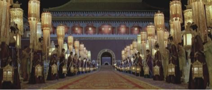
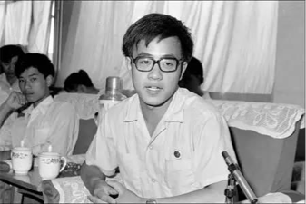
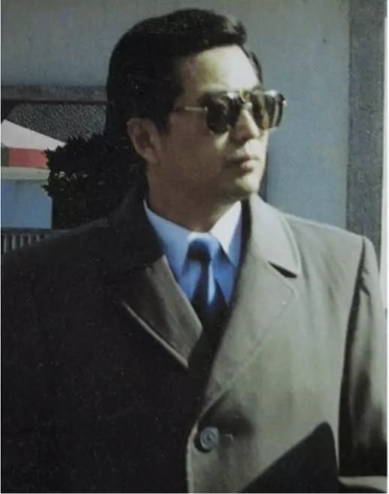
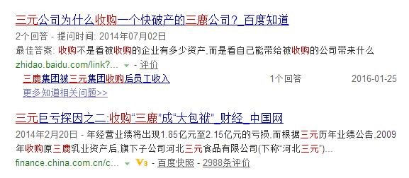
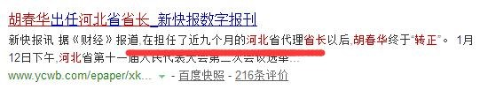
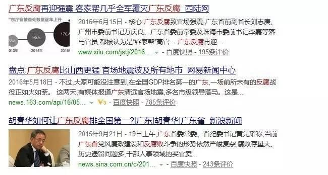
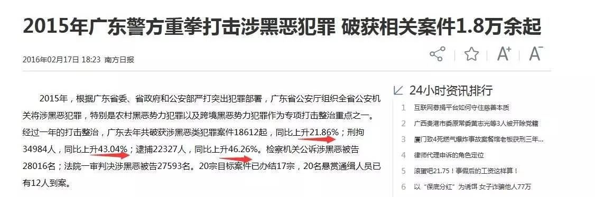

# 《东宫变》前传之春华传

1963年4月，湖北五峰土家族自治县的一个农村，一家平凡的穷苦农民家里，诞生了一个小男孩。

这个小娃娃逐渐长大，穷人的孩子早当家，初中高中都是走读，十里多的山路，走的脚板上厚厚一层老茧，中午靠带着的红薯充饥，和那个年代无数靠艰苦读书改变自己的命运的穷苦人一样，16岁的他，终于取得了北京大学的录取通知书，走出了大山去北大报道的时候，他没有用自己本来的名字。

他父亲叫王明俊，母亲胡长梅，他本姓王。他的一个姐姐早夭，不吉利，所以家人请乡间算命的来，然后他随了母亲的姓。

所以，本名王春华的他，用的是胡姓

走出大山的那一刻，他没有想到，他今生的命运，将与另一个姓胡的人，密不可分。

## 1、少年雄心，效力西藏

四年的大学时间转瞬即过，小胡一如既往的刻苦读书，一如既往的成绩优异，其他的就没什么特点，毕竟，北大里像他这样闷头读书的人太多了，不出彩。直到

20岁毕业的那个夏季，小胡一下子全国皆知。

原本北大毕业的他，被安排在北京工作，大山孩子能留在京师，该很满足了吧，让众人意外的是，他选择响应国家支援边疆号召，主动要求去西藏。

”中国是一个多民族国家，少数民族地区是大有作为的天地。我愿意到艰苦的地方去，我要将自己的青春献给西藏高原。”

那是一个热衷于树立榜样的时代，人民日报，新华社和中央电视台等媒体都对他的事迹进行了报道。最终，在媒体的鲜花掌声里，20岁的北大高材生，踏上了地球的屋脊，走向了仕途的起点。

## 2.仕途起点，得遇恩师

西藏是他仕途的起点，更是他的福地，因为在那里，他遇到了他的命中注定—— 和他一样姓胡的人。

1987年西藏叛乱，中央迟迟没有对叛乱表态，地方政府亚历山大，眼看着叛乱势头越来越大，就要冲击党政机关，那个姓胡的男人，赌上了自己的政治生命，毅然决然的下达了铁腕平叛的命令——“可以开枪！一切后果由我承担！”。西藏终于稳定了下去。

因为这件事，老胡进入了太上皇的视野，并最终被隔代指定为第四代接班人。

而不为所人所知的是，平叛期间，小胡为老胡的设立的联络队联络员，奔走于老胡与其他领导之间，也是始于此事，小胡第一次进入老胡视野，并最终两人纠缠一生。

## 3.中央镀金，河北出事

老胡被立为储君后，羽翼渐长，他所赏识的小胡深受其照顾，由地委副书记入京，团系统镀金，再放回西藏一路做到自治区常务副书记，并以此为跳板，荣升团中央第一书记，完成了组织部要求的资历程序后，调任河北省副省长。

这一步步，都是老胡精心为其设计的。西藏历来不是政治高地，政绩太难出，不出事就烧高香了，而且待久了怕像老胡一样，身子落下毛病。所以老胡替小胡挑了了河北。

当时为08年年初，中国头等大事就是北京奥运会，河北毗邻北京，是北京的前院，要配合北京做好奥运会的一切准备工作，所以，08年初小胡调去河北当代省长，不仅比西藏轻松，还可以等着8月份北京奥运会完满结束，北京河北两地干部论功行赏，这也是老胡的精心安排。

可惜，人算不如天算。

08年除了奥运会，雪灾汶川，还有一件大事，就是三鹿毒奶粉事件——发生在河北地界上。

年轻的小胡，这下摊上大事了。

长期在西藏工作的小胡，处理的更多的是民族纠纷和暴力冲突，对于如何处理三鹿奶粉案中盘根错节的政商关系，以及受害民众的利益诉求，并没有多少经验，于是，时任“三鹿奶粉重大安全事故应急处置领导小组组长”的小胡，处理的很是失败。

小胡没有主动承担河北省政府的管理责任，及时受理受害儿童的安抚和赔偿问题，反而强势驱赶聚集在河北省政府门口上诉的受害群众，让三鹿恶性事件越演越烈，

而三鹿集团负责人受地方实力派庇护，年纪轻轻没有斗争经验的小胡又啃不下，石家庄书记吴显国甚至在省常委上和小胡面对面拍桌子。

于是，上不能令三鹿高层伏法，下不能令受害百姓服气，整个三鹿事件极速恶化，最终世界哗然，小胡一时骂声如潮，岌岌可危。

关键时刻，还是老胡拉了他一把。

1. 老胡示意手下的北京郭金龙，金龙找来三元奶业老板。北京做生意的哪能没这点政治觉悟，于是有了三元收购三鹿。

2. 中央出面，担其责任，国家铁腕出手，三鹿管理层伏法。和小胡拍桌子的吴显国被杀鸡儆猴，涛哥止于此，不上究到小胡。

3. 老胡发力，小胡由代省长顺利转正成为省长。外界视为小胡三鹿事件”顺利过关“的信号。

想想现在还元气大伤缓不过劲来的国产乳业，想想挤破头都要去买国外奶粉的国民们。

唉，平步青云，误国误民！

## 3.避祸内蒙，引火烧身

转正为河北省长不到10个月，小胡匆匆升调内蒙，为何如此匆匆？因为河北已经待不下去了。涛哥十年，坊间戏言“政令不出中南海，民意不过长安街”。小胡要严查涉事的地方势力，而时任河北书记的张云川是军师的人，要2011年才能离任给小胡腾位子。省委书记是对手的人，地方势力又给小胡得罪光了，这三年叫小胡如何熬得下去？于是，涛哥不忍得意门生河北受虐，幕后运作，省长转正10个月后，小胡匆匆而去，走马上任内蒙，担任自治区党委书记。

老胡对小胡的情分，真是到了视如己出的地步啊……

涛哥选择内蒙给小胡，也是精心挑选过的，内蒙虽然也是自治区，但民族矛盾远远不如新疆西藏，而且内蒙是资源大省，有世界储量第一的稀土和大量的煤铁矿产资源，在胡温十年的黄金发展期，有如此发展利好的内蒙和山西一样，GDP是滚滚而来，小胡升调内蒙一把手，只要闷声发大财，他的政绩就等着大添一笔，好好弥补下河北三鹿事件带来的负面影响。

涛哥是用心良苦啊，可没想到，到了内蒙，小胡又出事了！

同样是矿！长期的开矿采矿，严重破坏了内蒙的生态资源，特别是里面还有大部分是非法的开采，蒙古族人已经很多怨气，矛盾日积月累，11年5月11日，在锡林郭勒盟草原——成吉思汗的发祥地，一蒙古族牧民企图阻拦运煤货车开入草原时被撞身亡，引发了锡林郭勒盟冲突事件。

这本是一起极其简单的民事纠纷事件，只要加以有效的引导，及时惩凶除弊给舆论一个交代，并和游行的蒙古族人保持心平气和的交流和劝导，对内蒙境内的有违环境保护的开采行为进行处理，就能完满的解决这一事件。

然而，这三点因素，导致花花采取了错误的处理措施！

1. 小胡长期呆在西藏，看的最多的是民族矛盾，受“藏独“惯性思维的影响，导致小胡误判形势，过于偏执于事件背后的所谓的”蒙独“因素

2. 小胡多年以来都是以老胡为榜样，涛哥西藏强势平叛，赢得拉萨之虎的称号并得以入主东宫，小胡内蒙遇到此事，也想效法先人，搞强势镇压，示好了涛哥，也捞足了资本

3. 因三鹿奶粉负面事件，小胡不得不远走内蒙，他立功心切，急于摆脱党内对他的怀疑，洗脱外界对他的骂名，所以剑走偏锋，未能理性分辨

面对此事，小胡施以高压政策，铁腕手段，结果招致蒙古民众恶性反弹，矛盾没得到有效解决反而激化，蒙古民众愈加心齐，反而倒逼了“蒙独”情绪，游行抗议半个月后，事态越演越烈，国际社会又一次高度关注。

面对引火烧身的爱子把事情搞成这个烂摊子，老胡又一次出手，调四个师的兵力入蒙，力行弹压，而后小胡去学校和群众和谈，一软一硬，才将事态控制住。唉，所谓的蒙独，比起疆独藏独，既没社会影响，又没民意基础，内蒙就安安稳稳的一块地儿，本来的游行是针对破坏自然环境的非法行为，和蒙独有多少瓜葛？小胡太不该误判形势，事件定性你就错了。

或者说，存了私心，就什么都错了。

## 4.南下广东，三个任务

小胡河北内蒙出事，搞得烂摊子，都由涛哥帮忙收拾。可就算收拾了，不仅外部质疑声没有散去，就是团派内部人员，也有很多言语。比如同为团派大将的周强童鞋，就不服过——“老师为何厚此薄彼”

然后，这两件事，和内外对小胡的不满之声，都没能动摇涛哥对其的信任，阻挡小胡继续前行的仕途。

12年12月，小胡由内蒙南下广东，接汪洋大海的班，主政南粤，仕途又上新台阶。

花花在广东，是带有很明确的政治任务来的。大海之前就是受命于涛哥，来清洗广东的水工势力，花花也继续这个任务。

最明显的就是13年5月31号，水工派的肠胃，原广东书记的三德子来广东视察，在和广东班子开会训话的时候，被花花和小丹气的摔杯子而走。

当时会场上三德子批评说花花你们啊，很多工作没做好，要按照中央指示的好好办。花花小丹当时就打断三德子的话：那都是上二任、三人任遗留下来的问题— —还不是你们水工的人搞的，顶了三德子。还很有准备的翻老黄历，你三德子主政广东的时候，有几千封民众来信，你当了那么几年，仅仅批了几百封信，去视察地方基层的次数，几年了才去了6次呢，不过两位数。

会议上两派人你来我往，唇枪舌剑，说不过的三德子摔了杯子愤而离场，第二天的预定活动都取消了，直接回京，呵呵。

除了这个任务，还有别的，那就是老大给的另外任务。

12年12月小胡上任，13年的3月14号，老大人大一次会议当选国家主席，当选后第二天3月15号，老大，李总理和王纪委就找来了小胡和朱小丹谈话。提到了广东必须解决好的三个老大难问题：

中共党的建设和反腐工作打黑和扫黄赌毒社会治安和商品市场假冒伪劣产品

并称这是硬任务，要啃下。

面对新君的郑重要求，需要洗脱自己负面评价的花花，慨然立下军令状，于是，广东轰轰烈烈的整治工作开始了！

反腐。广东落马厅官200多个，有名的那几个万庆良朱明国刘志庚，反腐势头比山西还猛！

然后是打黑，扫潮汕制毒村，打地下钱庄。作者在广东，知道广东之乱，真不是一般的乱！

可以这么说，岱岱虽然很反感小胡在河北和内蒙的败笔但是从这三年来看，我不得不说在广东，小胡能力和手段都成长了些，而且用对地方了 ，做了很多好事实事。

知错能改，亡羊补牢。一心为公，亦可称道。

## 5.综上所述，太史公曰

上面历数了他之前的事，他在河北和内蒙时期，经验不足，应对失措，误国误民，这是谁也洗地不了的。

同样，他三年来在广东的政绩，铁腕手段，大快人心，利国利民，也是谁也掩盖不了的。

太史公曰：盖棺者，方能定论。

这篇花花传未完待续小胡的政治生命也未完待续文章有什么不足的地方，欢迎指出，一起交流一起进步道声乏，晚安了
