# 瓜友们，周末快乐

 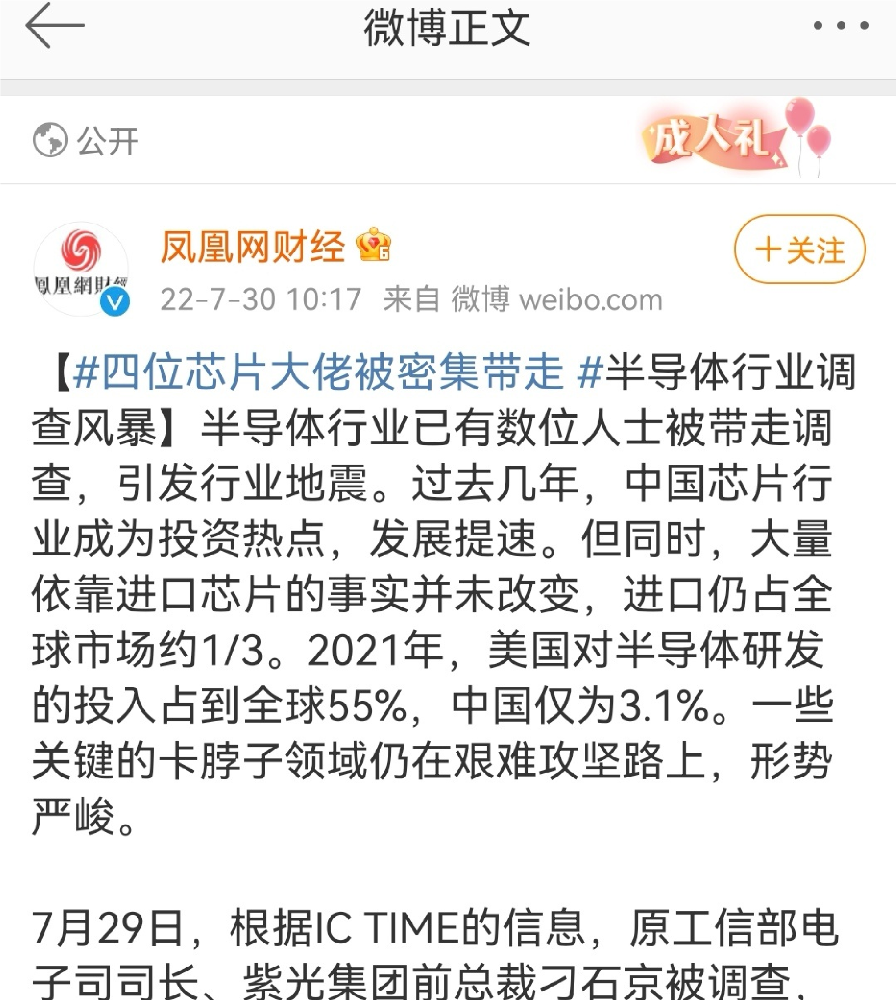

 首先，是之前岱岱提的集成电路基金窝案。

 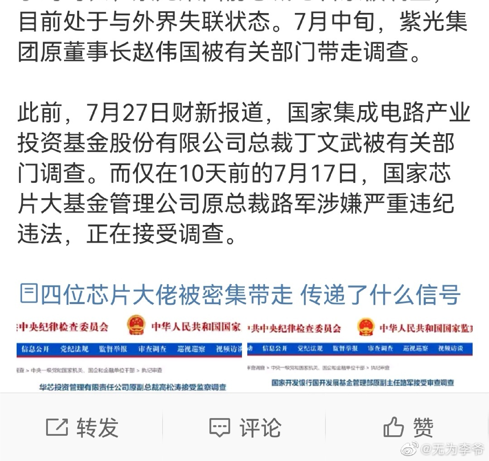

 国家搞这个集成电路基金，主要就是芯片。

 是14年就未雨绸缪搞的。

 为什么是14年搞呢？

 因为13年，芯片超过石油，成为中国进口金额最大的商品了。

 因为13年那个数据太过辣眼，所以国家立马行动起来，在

 14年搞了个国家基金去投资扶持半导体产业发展。

 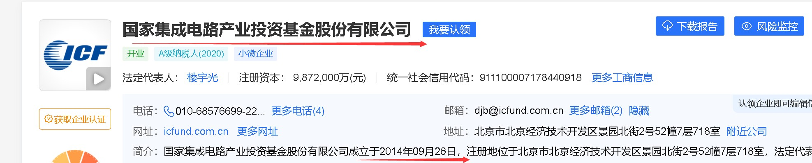

 2014年9月，在工信部、财政部的指导下，国家集成电路产业投资基金正式设立，其成立目的是为了扶持中国本土芯片产业，以减少对国外厂商的依赖，该基金被认为承载了扶持中国企业在集成电路市场上赶超欧美的使命。

公开资料显示，大基金是为促进集成电路产业发展于2014 年9月设立的，由国开金融、中国烟草、亦庄国投、中国移动、上海国盛、中国电科、紫光通信、华芯投资等企业于

 发起，基金规模约为1200亿元。基金重点投资集成电路芯

 片制造业，兼顾芯片设计、封装测试、设备和材料等产业，实施市场化运作、专业化管理。

 彼时，财政部主要是给钱，工信部是主要领导。然而，这帮人办事不靠谱。

 有些人，贪钱是贪钱，但能办事。

 有些人，则是贪了钱，还不能办事。

 集成电路基金那帮人，就属于贪钱不办事的。

 也是那时岁月静好，14年嘛，我们那时百年未有大变局的概念都没提出来。

 大变局都是17年年末提出来的。

 所以14年那会，那帮蛀虫认为，芯片这事美国不会卡中国脖子，国家让他们扶持本土芯片产业，这个很简单，糊弄一下做个数据坐下报告，就可以了。

 于是，他们就用手中的权力，去搞二级市场的内幕交易，大赚特赚。

 没想到，18年懂王上台来了一个贸易战，撕破脸，用芯片卡中国的脖子。

全国上下立马普及了芯片光刻机的基础知识，国家顶层设计更是加码半导体产业发展，开始严格验收亲自抓芯片工作。

 具体人是不歪。

 这下躺着赚钱不做事的他们，就无语了。

 如果不是懂王卡脖子，他们是能糊弄下去的。但懂王让他们慢慢露馅了，他们恨死懂王了。

 也正是18年后顶层亲自抓亲自验货，发现相关工作都是糊弄。

 但这帮人背景强大，有国开行背景+爱丁堡背景。

 后来肖亚庆2020年去执掌工信部，也被这帮人拉下了水。

 而揭开盖子的，是2019年的一次股市内幕交易案。

 高松涛1970年6月出生，河南西平人，为在职研究生学历，1991年7月参加工作。2014年10月至2019年11月，任华芯投资管理有限责任公司副总裁；2019年11月至今，任国家制造业转型升级基金股份有限公司总经理。

2019年12月中国证监会网站上披露的一份行政处罚决定书显示，高松涛在2017年任职期间卷入了一起与上市公司汇顶科技有关的内幕交易案，作为华芯投资副总裁，其全程参与了大基金受让汇顶科技股权事项的筹划、决策、执行等相关工作。

 这期内幕交易被抓，揭开了基金窝案的冰山一角。

 随后，我们顺着这个人不断打开缺口，2021年，此人被正式抓捕。

 2021年11月，中央纪委国家监委网站披露了华芯投资管理有限责任公司原副总裁高松涛涉嫌严重违法，正在接受监察调查的消息。

 牵出了华芯腐败。

 最终，牵出了华芯投资管理公司总裁，并参与大基金的管理的路军。

 也就是这个路军大佬的落马，牵出了肖亚庆。

 至此，集成电路基金窝案，正式开始高潮表现。

 后续的牛鬼蛇神都会抓的。

 不肃清这些腐败蛀虫，我们就是投一万亿去搞芯片，都搞不出来。

 你贪钱可以，至少也要做成事啊，贪钱又不能成事，实在是无语。

 在中美图穷匕见的关键阶段，芯片是关键领域。

 这个涉及到国运了，不肃清是搞不定的。

 其实，国家对芯片基金的拨乱反正，除了神仙打架的收集筹码外，也有对美斗争的因素。

 在我们搞芯片反腐的同时，我们成立了中矿。

 

 

这个公司最大的作用，不是对内，是对外。这家公司未来会联合国内所有钢铁企业，实施集中采购原则，然后统一和海外矿产巨头谈判，可能不仅仅只针对铁矿石，当然目前首要任务是铁矿石集中采购。

就像我们医疗集采一样，通过统一采购，迫使医药企业降低售价，目前医疗集采取得了成功，中矿会效仿这个模式，集中采购国外铁矿石，从而获得谈判优势，逐渐拿回主导权。

 这是吸取了06年失败的经验。

 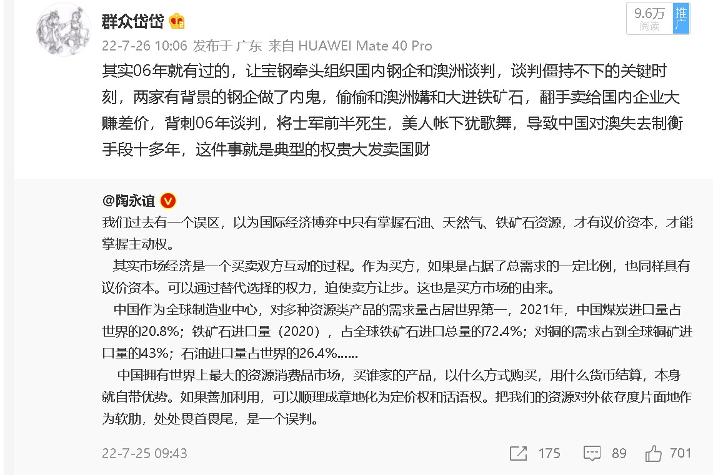

这样一看，今年7月份，国家两大重要战略资源，芯片和铁矿石，国家都出现了针对性的整顿动作。那么，就差原油了。

 估计，沙特那边快有消息了。

 芯片，铁矿石，原油，进口三大件能搞定的话，中国就稳多了。

 第二个事，聊下河南秋后算账。

 河南储户还是闹的好。

 7.10闹的好。

 本来河南一号是打算拖过去的，拖到11月后他就走人了，他不想进这个混水去搅。

 所以他提出了三零政策，“零上访、零事故、零案件”。

 一开始的赋红码，能赋红码的级别绝对不小，而且不是河南金融系统能搞的，卫生系统知道轻重更不可能去背锅。所以红码这个事，甚至可能都是当地一号给下面的暗示。

 拖，就硬拖，拖到11月了，接任的人再去处理这件事。

 但7.10的闹大，特别是针对他的横幅，让他无法再拖了。

 不得不正视问题，不得不去反腐抓人。

 于是，我们看到，7.10后，河南金融系统开始抓人。

 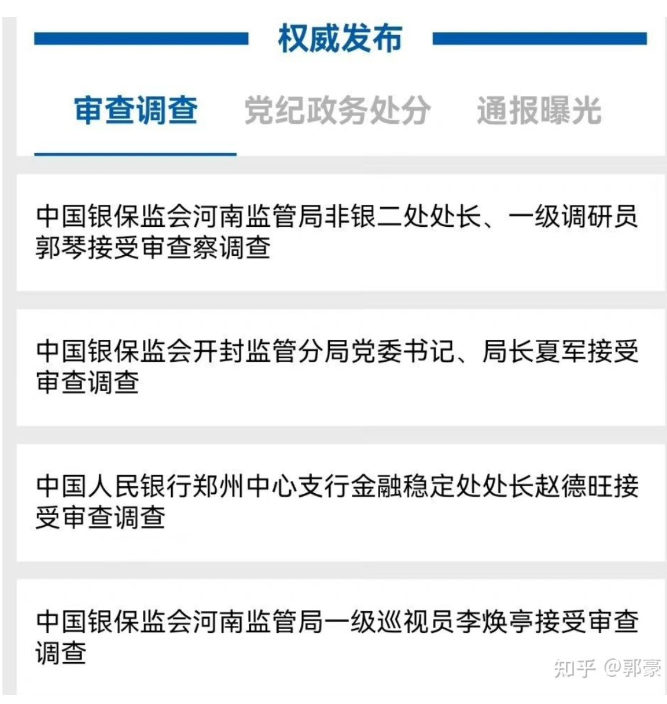

 这些，还都是科级处级的小鱼小虾。

 看一号的决心了。

 你看东北，辽宁一个省就对63名中小银行一把手采取了留置和刑事措施。

 而整个辽宁一共才一百家中小银行。

 近乎一半都被辽宁纪委给端了。

 河南真要抓，绝对能破辽宁的记录。

 所以说，河南如果抓几个小鱼小虾就停止了，那就是糊弄人。

 抓小鱼小鱼，让他们吐出真心话，交代出背后的大鱼，才是为人民服务的剧本。

 而很可能，以干部工作擅长的他，就算有深挖的心，也很难在短短3个月内结束。

 底下的捕快，知道他没几个月就要走了，拼命干活万一新来的不认账不给干活的他们兜底呢？他没有上面的亲笔批示（类似秦岭违建那种），是很难让手下捕快加班加点的，达不到辽宁那种力度。

 河南储户案的处理深挖，大概率要横跨两任河南都督了。

 等下一任都督带着御批上任吧。

 接着，说几句题外话。

 一个，是体制内的薪酬。

 这个，去年年末是降低的。

 甚至有体制内的要还钱，单位追缴，得前几年发的奖金还给单位。

 地方财政到如此地步了。

 一直有个说法，20th普天同庆，今年年底不至于再降低吧。

 存在这个可能。

 但总体趋势，的确是不断降低的。

大河不满小河干。

 人民创造财富的社会总经济，是大河。

 体制内的一切薪酬福利，都是小河。

 体制内本身不怎么创造财富，是分配财富罢了。

 经济下行还未见底的话，体制会一降再降的。

 政府也过苦日子，减轻财政矛盾，和抚平人民不满情绪。

 

 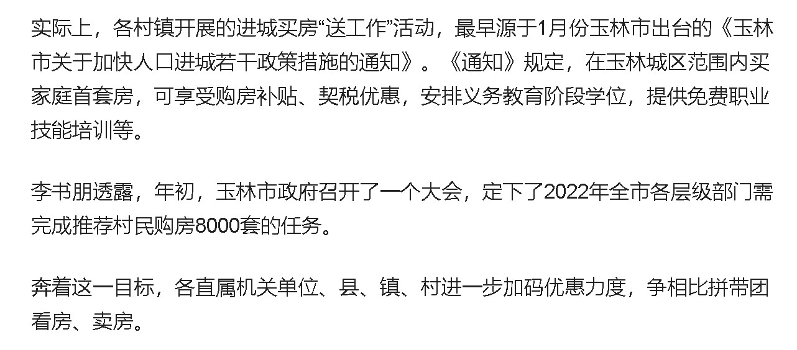

 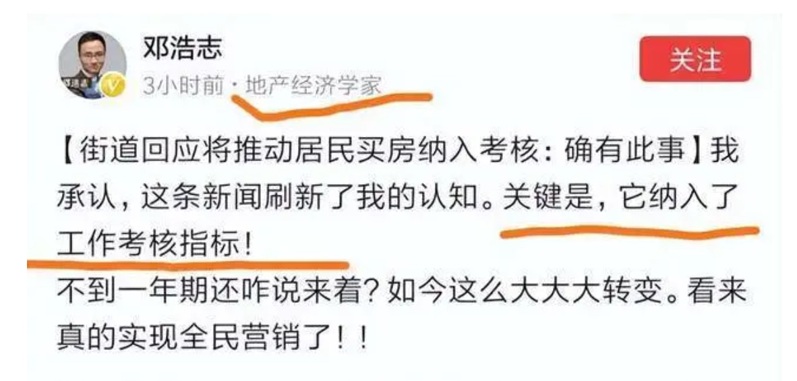

 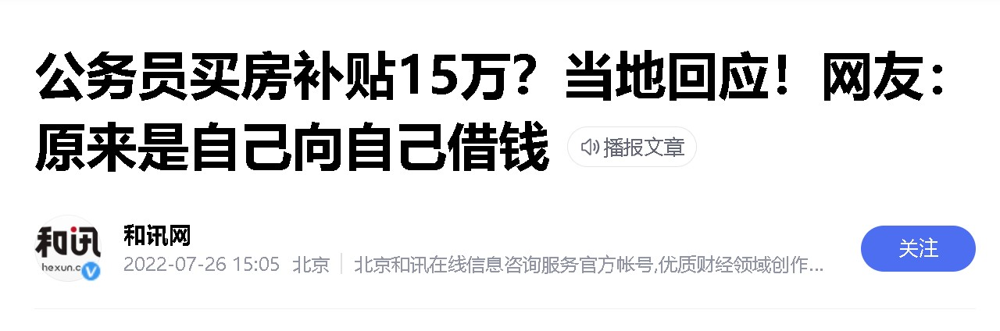

 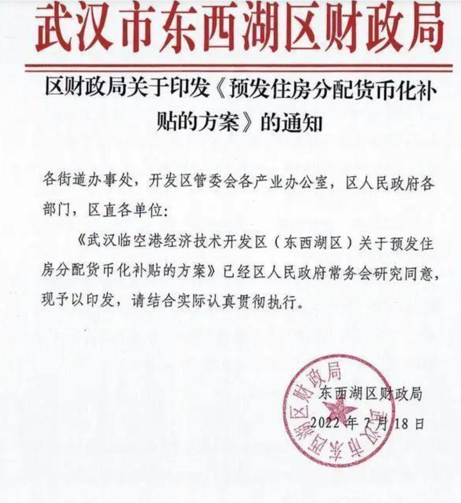

 镰刀终于割到了体制内头上了。

 这个是坏消息。

因为遭殃的多少体制内基层，都是人民的孩子，享福他们没享多少，背锅他们总是背锅。

 这也个好消息。

 《东方华尔街》有句台词说的好：破局的办法就是人人皆输，才会寻求重新制定规则!！

 等地方群魔乱舞昏招频出的差不多后，就是房地产税得到大家热烈欢迎的时候了。

 另外，就是负利率。

 关心存钱利率的家庭主妇们，最近可能发现了一个现象。

 之前银行都是巴不得你存钱越久越好，存三年定期的利率肯定低于存五年的。

 但最近不同的。

 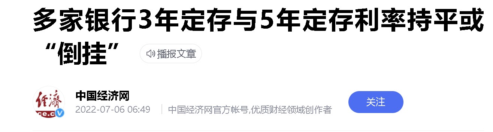

7月5日，记者在工商银行APP看到，5年期整存整取利率为

2.75%（人民币50元起存），多款3年期整存整取的产品利

率为3.15%，高于5年期产品利率

记者梳理发现，包括工商银行、农业银行、中国银行、交通银行等在内的多家银行3年期定存与5年期定存利率呈现持平或“倒挂”。此外，部分股份制银行的3年期定存与5年期定存利率也出现持平或“倒挂”现象。

这是为什么么？

岱岱微博上一言以蔽之：

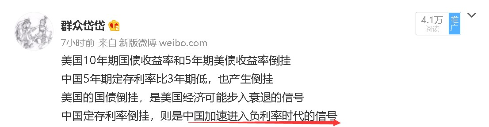

是的，负利率时代。

其实，岱岱已经提前一个月，给大家说中国未来会进入负利率时代了。

那是圈文《坐庄楼市》：

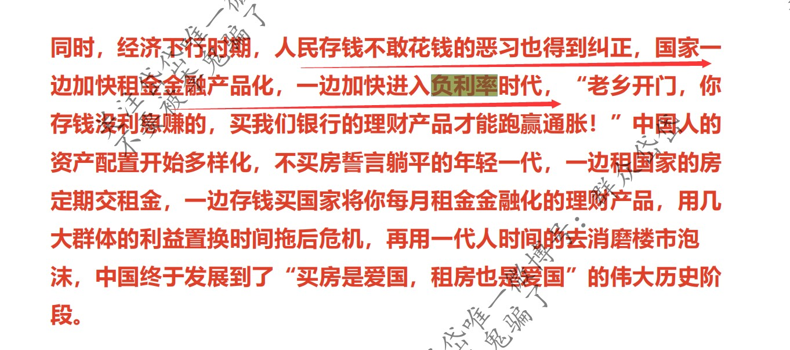

岱岱提出，只有负利率，才能让公租房的租金更好打包成理财产品买给人民。

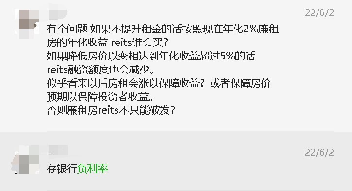

 以现在的利率来比较，公租房的租金要很高很高才能跑赢银行存款利率，不然就破发，而租金很高又压榨居民无法平衡市场，但未来如果是低利率乃至负利率时代，就算2%的年化收益，也会有人抢破头买的，一切都化解。

 一同化解的，还有几十万亿年利息万亿规模的地方债务，和老龄化时代低迷的消费。

 日本就是因为深度老龄化，没有消费没有投资，不得不搞低利率逼居民部门投资消费。

 一个负利率，不仅缓和楼市问题，还能缓和地方债务和老龄化。

 这是6月初岱岱的预判，中国加速进入负利率时代。

 然后，7月份，银行三年定存利率和五年定存正式产生倒挂。

 春江水暖鸭先知，提前了一个月。

 以后，中国家庭的投资渠道不得不被动的多元化了，长期利好股市保险等，当然，一个不健全的投资市场和不健康的国内金融系统，对韭菜的投资是处处皆坑的，希望国家在步入低利率负利率的过程中，能健全市场建设吧。
